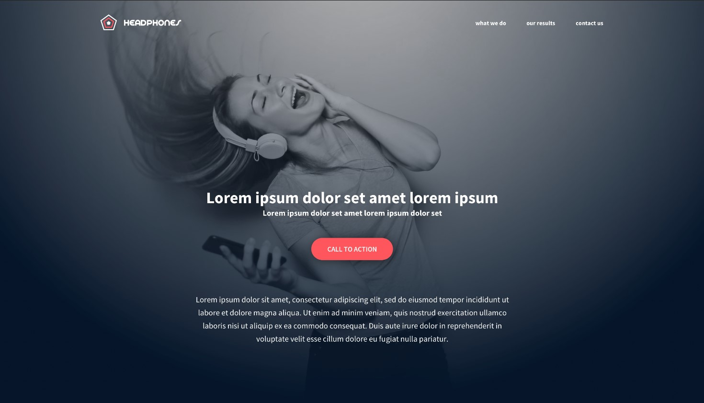

# Combined/updated README
In this project, you will implement from scratch, without any library, a web page. You will use all HTML/CSS/Accessibility/Responsive design knowledges that you learned previously.

You won’t have a lot of instruction, you are free to implement it the way that you want - the objective is simple: Have a fully functional web page that looks the same as the designer file.

Requirements
you are not allowed to import external CSS framework (like Bootstrap)
you are not to use Javascript

This is a README.md file where I will be doing my css work. This will include using images from figma

